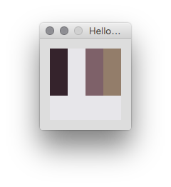

P5ColorThief
============

A Processing wrapper for [https://github.com/SvenWoltmann/color-thief-java](https://github.com/SvenWoltmann/color-thief-java)

Download the library [here](https://github.com/fabiantheblind/P5ColorThief/releases/download/1.0.0/P5ColorThief.zip).

##Examples  

### HelloP5ColorThief.pde  
  

Shows the basic usage of the library.  

### P5ColorThiefVideo.pde  
  

Shows how to extract color palettes from videos frame by frame.  

###Thanks

- Lokesh Dhakar - for the original Color Thief JavaScript version, available at [Color Thief](http://lokeshdhakar.com/projects/color-thief/)  
- Sven Woltmann - for writing the Java port available at [SvenWoltmann/color-thief-java · GitHub](https://github.com/SvenWoltmann/color-thief-java)

###License

Licensed under the Creative Commons Attribution 2.5 License  

Free for use in both personal and commercial projects.  
Attribution requires leaving author name, author homepage link, and the license info intact.  